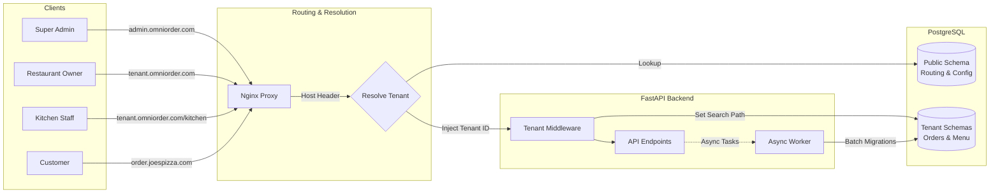

# OmniOrder

**A White-Label, Managed Micro-SaaS for Restaurant Order Management.**

## 1. Developer Quickstart

Follow these steps to get the OmniOrder Monorepo running locally using Docker and the provided validation scripts.

### Prerequisites
* Docker & Docker Compose
* Python 3.10+ (for validation scripts)
* Node.js 18+ (optional, if running frontend outside Docker)

### Step 1: Configure Local DNS
Since OmniOrder relies on subdomain/custom domain routing (e.g., `pizza.localhost`), you must map these domains to your local machine.

Add the following to your `/etc/hosts` (macOS/Linux) or `C:\Windows\System32\drivers\etc\hosts` (Windows):

```text
127.0.0.1   pizza.localhost
127.0.0.1   burger.localhost
127.0.0.1   omniorder.localhost

```

### Step 2: Boot the Stack

Run the entire platform (Postgres, FastAPI, React/Vite, Nginx) via Docker Compose:

```bash
docker-compose up --build

```

*Wait until you see the `api` service log: "Application startup complete".*

### Step 3: Provision Tenants & Seed Data

The database starts empty. Use the included Python script to create the schemas, seed menus, and simulate orders.

```bash
# In a new terminal window
pip install requests
python scripts/validate_mvp.py

```

### Step 4: Access the Interfaces

Once the stack is up and the script has passed:

| Interface | URL | Description |
| --- | --- | --- |
| **Pizza Hut Store** | [http://pizza.localhost](https://www.google.com/search?q=http://pizza.localhost) | Public customer storefront (Red Theme) |
| **Burger King Store** | [http://burger.localhost](https://www.google.com/search?q=http://burger.localhost) | Public customer storefront (Blue Theme) |
| **Pizza Hut Kitchen** | [http://pizza.localhost/kitchen](https://www.google.com/search?q=http://pizza.localhost/kitchen) | KDS for kitchen staff (Live WebSockets) |
| **API Docs** | [http://localhost:8000/docs](https://www.google.com/search?q=http://localhost:8000/docs) | Swagger UI |

---

## 2. Product Vision

**OmniOrder** is a production-grade, rapid-deployment order management platform designed for scale, isolation, and seamless branding.

Unlike generic platforms, OmniOrder offers a **fully white-labeled experience**. The platform administrator can "spin up" a new restaurant instance instantly. Critical to our value proposition is that we support **Custom Domains** (e.g., `order.joespizza.com`) alongside subdomains, with the frontend automatically adapting to the restaurant's brand identity (colors, fonts, logos) and hardware environment.

## 3. The OmniOrder Ecosystem (Stakeholders)

The platform is divided into four distinct interaction contexts, each catering to a specific user persona within the tenant lifecycle.

1. **The Super Admin (Platform Owner):**
* **Goal:** Manage the SaaS business, provision new tenants, and monitor fleet health.
* **Context:** Uses the **Global Admin Portal**. Decoupled from restaurant data.


2. **The Restaurant Owner (Tenant):**
* **Goal:** Manage menus, prices, and business hours.
* **Context:** Uses the **Manager Dashboard**. Data is strictly isolated to their schema.


3. **The Kitchen Staff (End User):**
* **Goal:** View and fulfill orders in a high-stress, messy environment.
* **Context:** Uses the **Kitchen Display System (KDS)** on tablets. Requires high reliability and offline resilience.


4. **The Hungry Customer (Public):**
* **Goal:** Order food quickly on a mobile device.
* **Context:** Uses the **Public Storefront**. Accessed via Custom Domains (e.g., `pizza.com`) with full brand immersion.


## 4. High-Level Architecture

The system follows a modern **Monorepo** structure containing a React frontend, a Python FastAPI backend, and a robust routing layer.

### The "Edge" Routing Layer

To support custom domains, we utilize a reverse proxy (Nginx) strategy before hitting the application logic.

* **Scenario A (Subdomain):** Request to `burger.omniorder.com`. The app extracts `burger` and queries the tenant config.
* **Scenario B (Custom Domain):** Request to `order.joespizza.com`. The Middleware inspects the `Host` header, queries the `public.tenants` table for a `custom_domain` match, and resolves the Tenant ID.

### Core Flows

* **Dynamic Theming (Flow A):** On load, the frontend fetches a configuration object. This triggers not just CSS variable injection, but also **Dynamic Asset Loading** (fetching Google Fonts on the fly).
* **Backend Isolation (Flow B):** A middleware interceptor identifies the tenant via the resolved ID and switches the PostgreSQL `search_path` to the specific tenant schema.



## 5. Technology Stack

### Frontend (Client)

* **Core:** React.js 18+ with Vite.
* **Styling Engine:** **Tailwind CSS**.
* **State Management:** Context API & Local Storage (MVP).
* **Hardware Integration:** Usage of `navigator.wakeLock` API for KDS tablets and Web Audio API for alerts.

### Backend (Server)

* **Framework:** FastAPI (Python 3.11+).
* **Database:** PostgreSQL 15+.
* **Isolation Strategy:** **Schema-per-Tenant**.
* **Real-time:** WebSockets for Kitchen Display System.

---

## 6. Theming & Customization Architecture

We do not build separate apps; we build one "chameleon" app that adapts its skin and assets at runtime.

### A. The Data Strategy

The styling configuration is stored in the `public` schema.

**Table: `public.tenants**`

```json
{
  "id": "uuid",
  "name": "Pasta Paradise",
  "domain": "pizza.localhost", 
  "theme_config": {
    "primary_color": "#FF5733",
    "font_family": "Playfair Display"
  }
}

```

### B. The Injection Strategy (Frontend)

Crucially, we must load assets that don't exist in the bundle.

1. **Boot:** `App.tsx` calls `GET /api/v1/store/config`.
2. **Asset Loader:** A `FontLoader` component parses `font_family`, constructs a Google Fonts URL, and dynamically appends a `<link>` tag to the document `<head>`.
3. **CSS Injection:** Tailwind colors are bound to CSS variables (`--primary`), which are updated via inline styles on the root layout.

## 7. Database Design & Operations

We utilize **PostgreSQL Schemas** for strong isolation.

1. **`public` Schema:** Contains shared system data (`tenants` table) and routing logic.
2. **Tenant Schemas:** (e.g., `tenant_pizzahut`, `tenant_burgerking`). Replicated for each client. Contains **only** operational data (Orders, Menu, Users).

## 8. Operational Workflow: Onboarding a New Client

### Step 1: Provisioning

The Super Admin hits `POST /api/v1/sys/provision`.

1. **Public Config:** The server inserts a record into the `public.tenants` table.
2. **Schema Generation:** The server triggers `CREATE SCHEMA tenant_x`.
3. **Table Hydration:** SQLAlchemy models create tables within that schema.
4. **Seeding:** Default menu items and admin users are created.

### Step 2: Verification

1. Admin visits `http://newtenant.localhost`.
2. The Edge Layer resolves the Host header.
3. The Frontend loads, injecting the specific theme and displaying the specific menu.