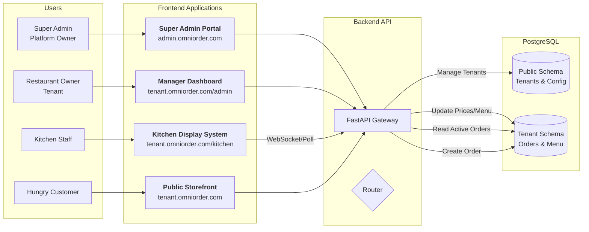

# OmniOrder

**A White-Label, Managed Micro-SaaS for Restaurant Order Management.**

---

## 1. Product Vision

**OmniOrder** is a high-performance, rapid-deployment order management platform designed for scale and isolation.

Unlike generic platforms, OmniOrder offers a **fully white-labeled experience**. The platform administrator can "spin up" a new restaurant instance instantly, with the frontend automatically adapting to the restaurant's brand identity (colors, fonts, logos, and layout spacing) without touching a single line of code.

---

## 2. High-Level Architecture

The system follows a modern **Monorepo** structure containing a React frontend and a Python FastAPI backend.

* **Request Routing:** The application determines the "Restaurant" context based on the incoming subdomain (e.g., `burger.omniorder.com`).
* **Dynamic Theming (Flow A):** On load, the frontend fetches a configuration object from the backend's `public` schema and injects brand colors into CSS variables at runtime.
* **Backend Isolation (Flow B):** For operational requests (like ordering), a specialized FastAPI middleware intercepts the request, identifies the tenant, and dynamically switches the PostgreSQL `search_path` to the isolated tenant schema before executing queries.



---

## 3. Technology Stack

### Frontend (Client)

* **Core:** React.js 18+ with Vite.
* **Styling Engine:** **Tailwind CSS**.
* *Key Strategy:* We configure `tailwind.config.js` to use CSS Variables (e.g., `bg-primary` maps to `var(--color-primary)`).


* **State Management:** React Query (Server State) & Zustand (Theme/UI State).

### Backend (Server)

* **Framework:** FastAPI (Python 3.11+).
* **Database:** PostgreSQL 16+.
* **Isolation Strategy:** **Schema-per-Tenant**.

---

## 4. Theming & Customization Architecture

This is the core differentiator. We do not build separate apps; we build one "chameleon" app.

### A. The Data Strategy

The styling configuration is stored in the `public` schema in the database.

**Table: `public.tenants**`

```json
{
  "id": "uuid",
  "name": "Pasta Paradise",
  "subdomain": "pasta",
  "theme_config": {
    "colors": {
      "primary": "#FF5733",       // Brand Main Color
      "secondary": "#C70039",     // Accents
      "background": "#FFF5E1",    // Page Background
      "text": "#2C3E50"           // Primary Text
    },
    "typography": {
      "fontFamily": "Inter, sans-serif",
      "headingFont": "Playfair Display, serif"
    },
    "layout": {
      "borderRadius": "0.5rem",   // Rounded corners preference
      "logoUrl": "https://s3.../pasta-logo.png"
    }
  }
}

```

### B. The Injection Strategy (Frontend)

1. **Boot:** App loads. `App.jsx` checks the window URL.
2. **Fetch:** Calls `GET /api/public/config`.
3. **Inject:** A `ThemeProvider` component writes these values to the `:root` of the document.

```css
/* Resulting DOM State */
:root {
  --color-primary: #FF5733;
  --color-bg: #FFF5E1;
  --radius-base: 0.5rem;
}

```

4. **Render:** Tailwind classes like `bg-primary` or `rounded-base` automatically display the correct brand.

---

## 5. Database Design & Isolation

We utilize **PostgreSQL Schemas** to achieve strong data isolation while keeping the "System Data" (like themes) accessible globally.

### 1. `public` Schema (Shared System Data)

Managed by the Super Admin.

* **`tenants` table:**
* `subdomain` (Index, Unique) -> Used for routing.
* `schema_name` -> Used for DB switching.
* `theme_config` (JSONB) -> **Stores the branding.**


### 2. Tenant Schemas (e.g., `tenant_bobs_burgers`)

Replicated for each client. Contains **only** operational data.

* `orders`
* `menu_items`
* `customers`

---

## 6. Repository Structure

```bash
omniorder/
├── backend/
│   ├── app/
│   │   ├── api/
│   │   │   ├── endpoints/
│   │   │   │   ├── public.py      # Theme/Config endpoints (No Auth)
│   │   │   │   └── orders.py      # Tenant specific endpoints
│   │   ├── core/
│   │   │   └── config.py
│   │   └── middleware/            # Tenant & Schema Switcher
│   └── manage.py                  # "Spin up" script
├── frontend/
│   ├── src/
│   │   ├── components/            # Generic UI (Buttons, Cards)
│   │   ├── theme/
│   │   │   ├── ThemeProvider.jsx  # Logic to inject CSS vars
│   │   │   └── defaultTheme.js    # Fallback if DB fetch fails
│   │   └── features/              # Menu, Cart, Admin
│   └── tailwind.config.js         # Mapped to CSS Variables
└── docker-compose.yml

```

---

## 7. Developer Workflow: Adding a New Client

You do not touch the code to add a client. You use the CLI.

1. **Run Provisioning Script:**
```bash
# Usage: python manage.py create-tenant [Name] [Subdomain] [PrimaryColor]
python manage.py create-tenant "Sushi Zen" "sushi" --color "#FF0000"

```


2. **What Happens Automatically:**
* **DB:** Creates schema `tenant_sushi`.
* **Migrations:** Runs Alembic on `tenant_sushi`.
* **Routing:** Inserts row into `public.tenants` with subdomain `sushi`.
* **Theming:** Saves the hex code `#FF0000` into the `theme_config` JSON.


3. **Result:**
Visit `sushi.localhost:3000`. The site loads with "Sushi Zen" branding and Red buttons.

---


## 8. Admin Portals & User Interfaces

OmniOrder provides three distinct user interfaces, each tailored to a specific stakeholder in the ecosystem.

### A. The Super Admin Portal (Platform Management)

**URL:** `https://admin.omniorder.com`
**User:** You (The SaaS Provider)

This is the "God Mode" interface. It is completely decoupled from specific restaurant data and focuses purely on tenant orchestration.

* **Tenant Provisioning:** A UI form to create new restaurant instances.
* Input: Restaurant Name, Desired Subdomain (e.g., `pizza`), Admin Email.
* *Action:* Triggers the backend provisioning script to generate schemas and routing rules.


* **Global Theme Editor:** Visual color picker and font selector to set the initial branding for a new client without touching JSON.
* **Subscription Management:** Toggle tenant status (Active/Suspended) based on payment status.

### B. The Restaurant Manager Dashboard (CMS)

**URL:** `https://{tenant}.omniorder.com/admin`
**User:** The Restaurant Owner / Manager

A secure, password-protected backend for the specific restaurant to manage their business logic. This connects exclusively to the specific **Tenant Schema**.

* **Menu Engineering:**
* Create categories (Starters, Mains, Drinks).
* Upload images for items.
* **Price Adjustment:** Real-time editing of item prices (e.g., Happy Hour updates).
* "86" Items: One-click toggling of item availability (Out of Stock).


* **Business Settings:**
* Configure opening hours.
* Set tax rates and currency symbols.


### C. The Kitchen Display System (KDS)

**URL:** `https://{tenant}.omniorder.com/kitchen`
**User:** Chefs & Kitchen Staff

A high-contrast, touch-friendly interface designed for tablets mounted in the kitchen. It replaces traditional paper tickets.

* **Kanban Workflow:** Orders move through columns: `Incoming` -> `Prep` -> `Ready`.
* **Real-Time Updates:** Uses **Server-Sent Events (SSE)** or Polling to pop new orders onto the screen instantly with an audible alert.
* **Ticket Details:** clear visualization of modifications (e.g., "NO ONIONS" highlighted in red).
* **Performance Metrics:** Tracks how long an order stays in the "Prep" stage.

---