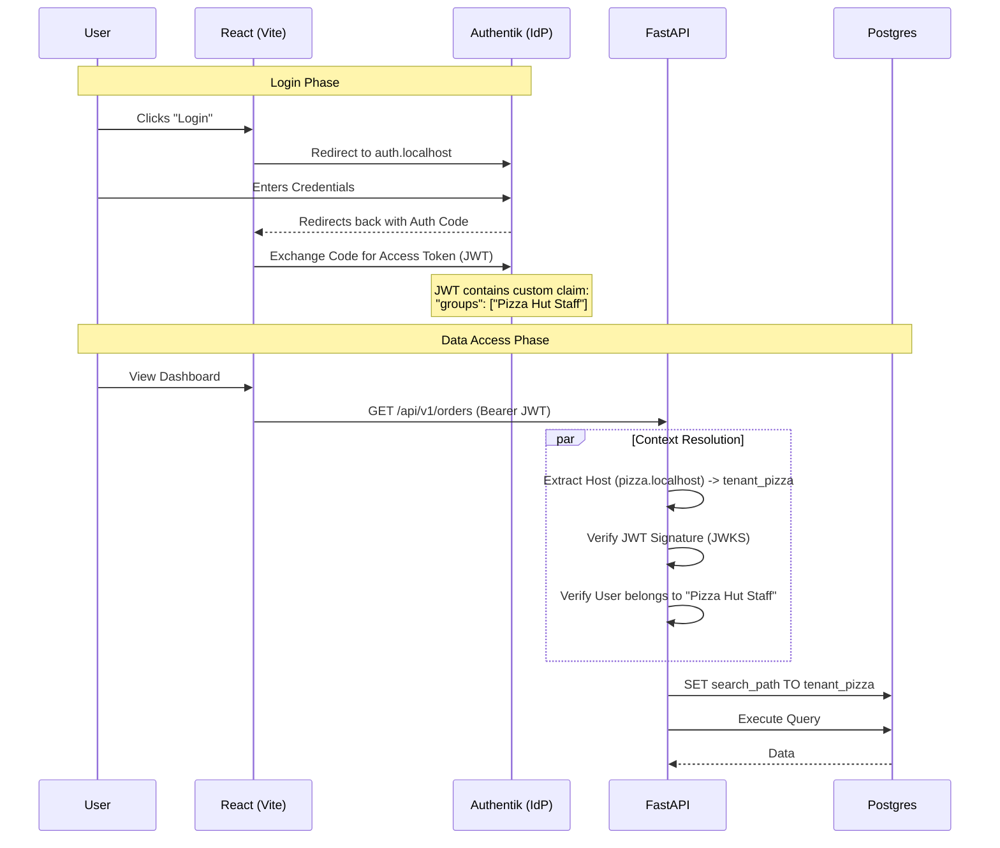

# Authentication & Identity Architecture

## 1. Executive Summary

OmniOrder uses **OpenID Connect (OIDC)** via **Authentik** for all identity management. 

Instead of managing passwords locally, we federate identity. The backend (FastAPI) is stateless, verifying JWT signatures via JWKS. The frontend (React) uses the Authorization Code flow with PKCE.

Crucially, **Multi-Tenancy** is enforced via **Group Membership claims** injected into the JWT.

---

## 2. Architecture Diagram




---

## 3. Configuration Guide (Automated)

We use a Python script to bootstrap the entire Authentik configuration (Provider, App, Groups, Scope Mappings, and Users).

### Prerequisites

1. **Boot the Stack:** Ensure `docker-compose up -d` is running.
2. **Initialize Authentik:** * Go to **[http://auth.localhost/if/flow/initial-setup/](https://www.google.com/search?q=http://auth.localhost/if/flow/initial-setup/)**.
* Set the password for the default `akadmin` user.


### Step 1: Generate Admin Token

To allow the script to configure Authentik, you need an API Token.

1. Log in to [http://auth.localhost](https://www.google.com/search?q=http://auth.localhost) as `akadmin`.
2. Go to **Admin Interface** (Top right button).
3. Navigate to **Directory** > **Token & App Passwords**.
4. Click **Create**.
* **Identifier:** `bootstrapper`
* **User:** `akadmin`


5. **Copy the Token Key** (it starts with `ak_...` or similar).

### Step 2: Run the Bootstrap Script

1. Open `scripts/setup_auth.py`.
2. Paste your token into the `API_TOKEN` variable (format: `"Bearer <token>"`).
3. Run the script:
```bash
# Ensure requests is installed (pip install requests)
python scripts/setup_auth.py

```


### Step 3: What the Script Does

The script performs the following idempotent actions via the Authentik API:

1. **Creates Scope Mapping:** Defines a custom scope named `groups` that injects the user's Authentik groups into the JWT.
2. **Creates Provider:** Sets up the OAuth2 provider with `omniorder-web` Client ID and wildcard redirect URIs for localhost subdomains. It attaches the `groups` scope automatically.
3. **Creates Application:** Creates the "OmniOrder" app and links it to the Provider.
4. **Creates Groups:**
* `Super Admins`
* `Pizza Hut Staff`
* `Burger King Staff`


5. **Seeds Users:** Creates default users and assigns them to the correct groups.

| User | Password | Group | Access |
| --- | --- | --- | --- |
| `jesse_admin` | `password` | Super Admins | `admin.omniorder.localhost` |
| `pizza_manager` | `password` | Pizza Hut Staff | `pizza.localhost` |
| `burger_manager` | `password` | Burger King Staff | `burger.localhost` |

---

## 4. Frontend Integration Details

The frontend uses `react-oidc-context`. Configuration is located in `apps/web/src/context/AuthContext.tsx`.

* **Authority:** `http://auth.localhost/application/o/omniorder/`
* **Client ID:** `omniorder-web`
* **Redirect URI:** `window.location.origin + ...` (Dynamic based on current subdomain).

## 5. Backend Enforcement Details

The API (`apps/api/app/api/v1/deps.py`) enforces security using the token claims.

1. **JWKS Validation:** It fetches keys from `http://authentik-server:9000/...` (Internal Docker Network) to validate the signature.
2. **Group Check (Recommended):**
* If `Host: pizza.localhost`, the token **MUST** contain `Pizza Hut Staff` in the `groups` list.
* If `Host: admin.omniorder.localhost`, the token **MUST** contain `Super Admins`.