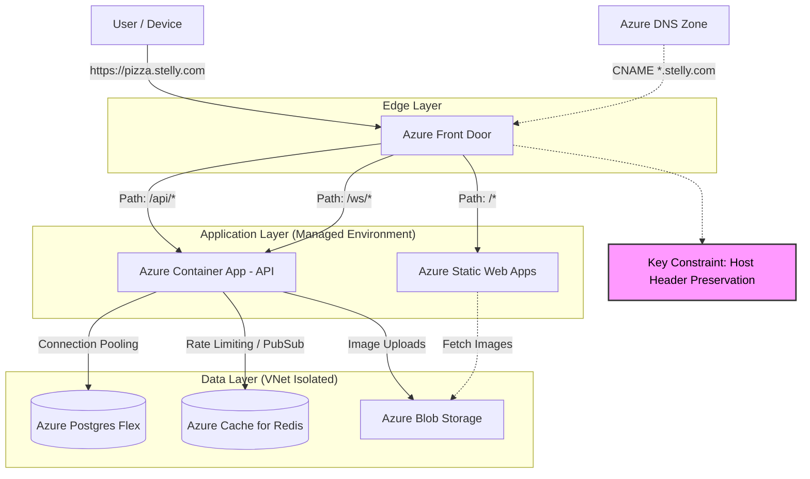
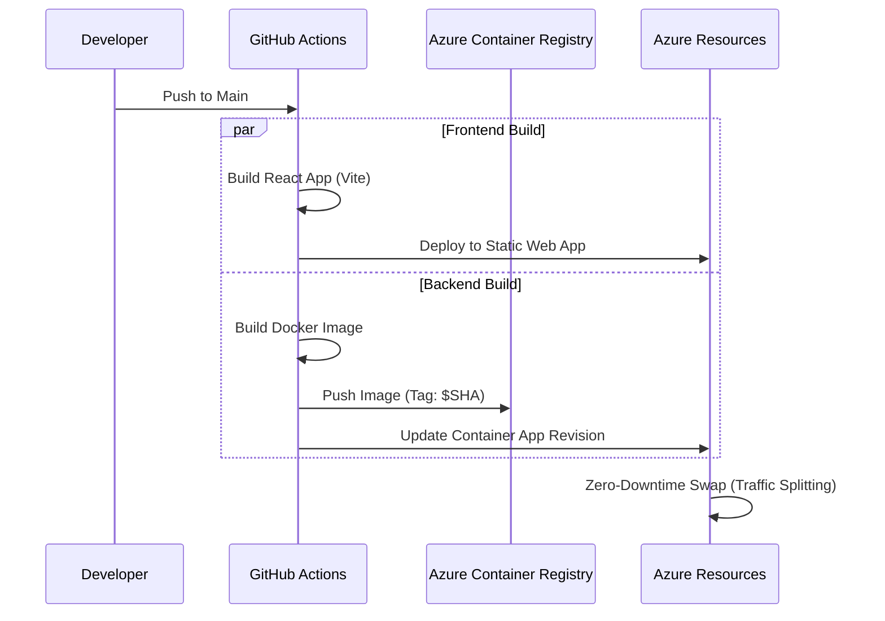

# Stelly: Azure Cloud Architecture

## 1. Executive Summary

This document outlines the production cloud infrastructure for Stelly hosted on **Microsoft Azure**.

The architecture transitions from the local Docker Compose environment to a scalable, serverless-first PaaS (Platform as a Service) model. This design prioritizes cost-efficiency (scaling to zero), strict security (VNet isolation), and global performance (CDN edging).

### Key Architectural Decisions

* **Frontend:** Moved to **Azure Static Web Apps (SWA)** for global distribution and automated CI/CD.
* **Backend:** Hosted on **Azure Container Apps (ACA)** to allow serverless scaling based on HTTP traffic and event triggers.
* **Database:** **Azure Database for PostgreSQL (Flexible Server)** facilitates the "Schema-per-Tenant" pattern with connection pooling.
* **Edge Routing:** **Azure Front Door** acts as the global entry point, handling SSL termination for wildcard domains (`*.stelly.com`) and routing traffic based on path (`/` vs `/api`).

---

## 2. Infrastructure Diagram

The following diagram illustrates the flow of traffic from a customer to the data layer.

---

## 3. Component Mapping: Local to Cloud

| Local Component | Azure Resource | Configuration / SKU |
| --- | --- | --- |
| **Nginx** | **Azure Front Door** | Standard/Premium. configured for Wildcard Domains. Replaces Nginx reverse proxying logic. |
| **Web (Vite)** | **Static Web Apps** | Standard Plan. Deployed via GitHub Actions. Global CDN included. |
| **API (FastAPI)** | **Container Apps** | Consumption Plan. KEDA enabled for scaling. Ingress set to "External". |
| **Postgres** | **PostgreSQL Flex** | Burstable (B-series) for Dev, General Purpose (D-series) for Prod. High Availability enabled. |
| **Redis** | **Azure Redis** | Basic (C0/C1) for Dev, Standard for Prod. |
| **MinIO** | **Blob Storage** | Standard General Purpose V2. Public container for `stelly-assets`. |

---

## 4. Routing & Multi-Tenancy Strategy

Routing is the most critical aspect of the Stelly architecture. The backend middleware relies on the `Host` header (e.g., `pizza.stelly.com`) to determine which database schema (`tenant_pizza`) to access.

### The Challenge

Cloud load balancers and proxies often strip the original `Host` header and replace it with the origin host (e.g., `stelly-api.azurecontainerapps.io`).

### The Azure Solution: Front Door

We use **Azure Front Door** as the Layer 7 Load Balancer to solve this:

1. **Wildcard DNS:** A CNAME record for `*.stelly.com` points to the Front Door endpoint.
2. **Origin Groups:**
* **Frontend Origin:** Points to the Static Web App.
* **Backend Origin:** Points to the Container App.

3. **Routing Rules:**
* **Rule A (API):** If path starts with `/api` OR `/ws` → Route to **Backend Origin**.
* **Rule B (Static):** Else → Route to **Frontend Origin**.

4. **Header Preservation:** Front Door is configured to forward the original `Host` header to the backend origin.

#### Request Lifecycle Example

1. User visits `burger.stelly.com/menu`.
2. **Front Door** receives request.
3. Matches **Rule B** (Static). Forwards to SWA.
4. Browser loads React App.
5. React App makes XHR to `https://burger.stelly.com/api/v1/store/menu`.
6. **Front Door** receives request.
7. Matches **Rule A** (API).
8. Forwards to **Container App**.
* **Crucial:** Sends `Host: burger.stelly.com`.

9. **FastAPI Middleware** extracts `burger` from host.
10. Database looks up `burger` -> `schema_burgerking`.
11. Query executes on correct schema.

---

## 5. Storage & Assets

### Blob Storage (Replacing MinIO)

We use Azure Blob Storage to store menu images.

* **Container Name:** `stelly-assets`.
* **Access Level:** `Blob` (Anonymous read access for public delivery).
* **Integration:**
* The `boto3` library used in `core/storage.py` is compatible with Azure Blob Storage via the [Azure Storage Proxy](https://www.google.com/search?q=https://github.com/Azure/azure-storage-gateway) or by refactoring `storage.py` to use `azure-storage-blob` SDK (Recommended for production).
* **CDN:** Images are cached at the edge via Azure Front Door to minimize latency for menu loading.

---

## 6. Security & Scaling

### Identity & Secrets

* **Managed Identities:** The Container App connects to Key Vault, Postgres, and Blob Storage using Azure Managed Identities. No connection strings or access keys are stored in the codebase or environment variables.
* **Key Vault:** Stores sensitive values (like the `KZ_SECRET_KEY` for JWTs).

### Database Security

* **VNet Injection:** The PostgreSQL Flexible Server is deployed into a private Virtual Network (VNet).
* **Access:** The Container App Environment is integrated into the same VNet, allowing secure, private communication with the DB without exposing port 5432 to the internet.

### Auto-Scaling (KEDA)

The API runs on Azure Container Apps, which utilizes KEDA (Kubernetes Event Driven Autoscaling).

* **HTTP Scaling:**
* Min Replicas: 1 (or 0 for cost saving in dev).
* Max Replicas: 10.
* Rule: Scale up if concurrent requests > 50.

* **Queue Scaling (Future):** If async workers (Celery) are deployed, KEDA can scale workers based on Redis List length.

---

## 7. Deployment Pipeline (CI/CD)

Deployments are handled via **GitHub Actions**.

1. **Frontend:** The `azure-static-web-apps-deploy` action automatically detects the React build and publishes it.
2. **Backend:**
* Build Docker image.
* Push to **Azure Container Registry (ACR)**.
* Update the Container App to point to the new image tag.
* ACA handles the traffic splitting and graceful shutdown of old revisions.