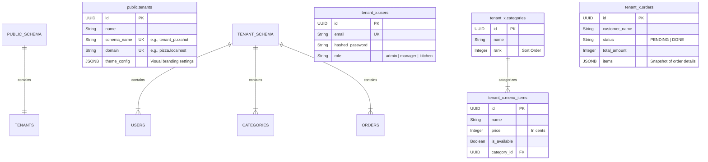

# Database Design Document: OmniOrder

## 1. Executive Summary

**System Type:** Multi-Tenant SaaS
**Database Engine:** PostgreSQL 15+
**Isolation Strategy:** **Schema-per-Tenant**

OmniOrder utilizes a hybrid database architecture. It maintains a single **Public Schema** for global routing and tenant configuration, while utilizing distinct **Tenant Schemas** (`tenant_xyz`, `tenant_abc`) for all operational data (users, orders, menus).

### Why Schema-per-Tenant?

1. **Strict Isolation:** Data leakage between restaurants is impossible at the database layer. `SELECT * FROM orders` only ever returns data for the active schema.
2. **Compliance:** Simplifies GDPR/CCPA compliance (easy to drop a specific schema).
3. **Naming Collisions:** Every tenant can have an order `#1001` or a user `admin@domain.com` without unique constraint conflicts.

---

## 2. High-Level Entity Relationship Diagram (ERD)

---

## 3. Schema 1: The Public Layer

**Namespace:** `public`

This layer acts as the "Switchboard" for the application. It is the only schema that the application connects to initially before resolving the request context.

### Table: `tenants`

The registry of all restaurant clients.

| Column | Type | Constraints | Description |
| --- | --- | --- | --- |
| **`id`** | `UUID` | **PK**, Default: `uuid4` | Unique platform ID for the tenant. |
| `name` | `VARCHAR` | Not Null | Human-readable name (e.g., "Pizza Hut"). |
| `schema_name` | `VARCHAR` | **Unique**, Not Null | The physical Postgres schema name (e.g., `tenant_pizzahut`). Used in `SET search_path`. |
| `domain` | `VARCHAR` | **Unique**, Not Null | The incoming Host header used for routing (e.g., `pizza.localhost`). |
| `theme_config` | `JSONB` | Default: `{}` | Stores branding: `primary_color`, `font_family`, `preset`. |

---

## 4. Schema 2: The Tenant Layer

**Namespace:** `tenant_{clean_name}` (Dynamic)

This structure is replicated identically for every tenant. Changes here must be migrated across *all* tenant schemas simultaneously.

### Table: `users`

Authentication and Authorization.

| Column | Type | Constraints | Description |
| --- | --- | --- | --- |
| **`id`** | `UUID` | **PK**, Default: `uuid4` | Unique User ID. |
| `email` | `VARCHAR` | **Unique**, Index | Username for login. |
| `hashed_password` | `VARCHAR` | Not Null | Bcrypt hash. |
| `full_name` | `VARCHAR` | Nullable | Staff member name. |
| `role` | `VARCHAR` | Default: `'admin'` | Scope control (Future: RBAC implementation). |

### Table: `categories`

Menu organization structure.

| Column | Type | Constraints | Description |
| --- | --- | --- | --- |
| **`id`** | `UUID` | **PK**, Default: `uuid4` | Unique Category ID. |
| `name` | `VARCHAR` | Not Null | Display name (e.g., "Mains", "Drinks"). |
| `rank` | `INTEGER` | Default: `0` | Controls sorting order in the UI. |

### Table: `menu_items`

The actual products for sale.

| Column | Type | Constraints | Description |
| --- | --- | --- | --- |
| **`id`** | `UUID` | **PK**, Default: `uuid4` | Unique Item ID. |
| `category_id` | `UUID` | **FK** (`categories.id`) | Logical grouping. |
| `name` | `VARCHAR` | Not Null | Product name. |
| `description` | `TEXT` | Nullable | Marketing copy. |
| `price` | `INTEGER` | Not Null | **Stored in cents** to avoid floating point errors (e.g., $10.00 = `1000`). |
| `image_url` | `VARCHAR` | Nullable | Link to external image storage. |
| `is_available` | `BOOLEAN` | Default: `True` | Quick toggle for "Sold Out" status (KDS). |

### Table: `orders`

Transactional records.

| Column | Type | Constraints | Description |
| --- | --- | --- | --- |
| **`id`** | `UUID` | **PK**, Default: `uuid4` | Unique Order ID. |
| `customer_name` | `VARCHAR` | Not Null | Name provided at checkout. |
| `status` | `VARCHAR` | Default: `'PENDING'` | Workflow state (`PENDING` -> `COOKING` -> `DONE`). |
| `total_amount` | `INTEGER` | Not Null | Final transaction value in cents. |
| `items` | `JSONB` | Not Null | **Data Snapshot.** Stores a JSON array of the items *at the time of purchase*. |

> **Why JSON for Order Items?**
> We do not use a relational `order_items` table in this design. Using a JSON snapshot ensures that if a restaurant changes the price or name of "The OmniBurger" next week, the historical order record remains accurate to what was actually purchased today.

---

## 5. Technical Implementation Details

### A. Tenant Resolution Flow

How the API knows which schema to query:

1. **Intercept:** Middleware catches the HTTP Request.
2. **Extract:** Reads `Host: pizza.localhost` header.
3. **Lookup:** Queries `public.tenants` to find `schema_name = 'tenant_pizzahut'`.
4. **Context Switch:** Executes the raw SQL command on the session:

5. **Execution:** All subsequent SQLAlchemy queries (e.g., `db.query(Order).all()`) implicitly target `tenant_pizzahut.orders`.

### B. Provisioning (The "God Mode" Transaction)

When `POST /api/v1/sys/provision` is called, the following transactional sequence occurs:

1. **Validation:** Check if `domain` is unique in `public`.
2. **Record:** Insert into `public.tenants`.
3. **DDL Execution:** `CREATE SCHEMA IF NOT EXISTS tenant_xyz`.
4. **Migration:** SQLAlchemy metadata `create_all` is run *bound* to the new schema.
5. **Seeding:** Default Admin and Menu Items are inserted via SQL.

### C. Migration Strategy (Alembic)

Managing schema changes across 1 vs. 1,000 tenants is handled in `apps/api/alembic/env.py`.

* **Public Migrations:** Filter `include_object` where `schema == 'public'`.
* **Tenant Migrations:**
1. Alembic fetches a list of all schemas from `public.tenants`.
2. It iterates through the list.
3. For each schema, it sets the search path and runs the migration script (e.g., `add_column_loyalty_points`).

---

## 6. Future Data Scaling Considerations

1. **Connection Pooling:** Currently, the system relies on a single pool. As tenants grow, `pgbouncer` should be introduced to multiplex connections across schemas.
2. **Cross-Tenant Analytics:** Running `SELECT sum(total_amount)` across 1,000 schemas is slow. A generic ETL pipeline will be needed to aggregate data into a `public.analytics` warehouse table.
3. **Archival:** Old orders in tenant schemas should be moved to cold storage (S3 Parquet files) after 12 months to keep index sizes small.

