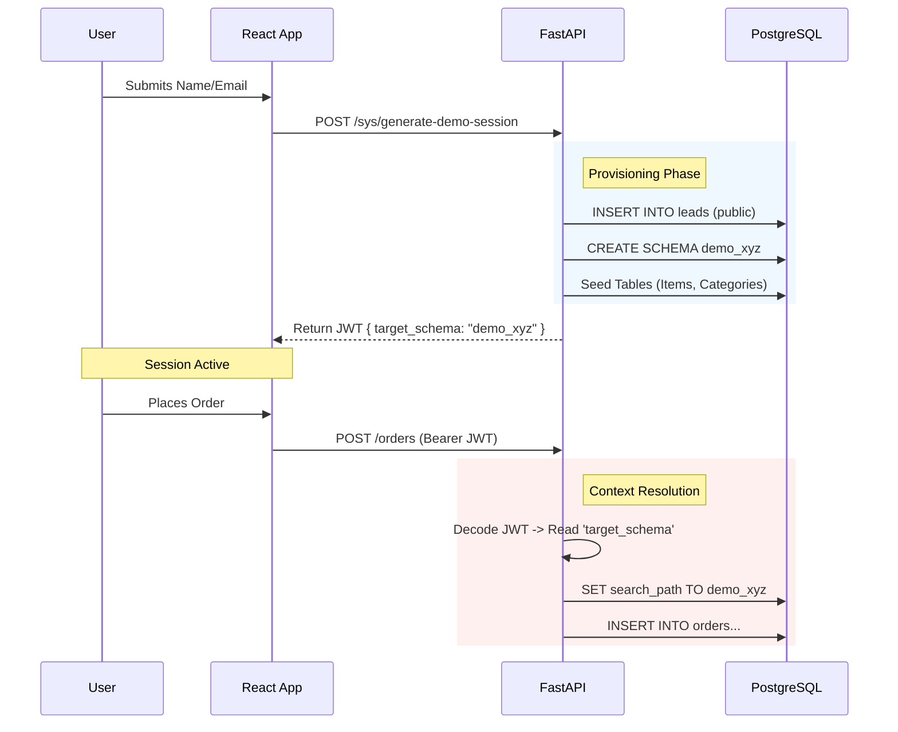

# The Stelly Demo Experience

## 1. Executive Summary

The **Stelly Demo** is a high-fidelity sales and engineering showcase. Unlike typical static demos, Stelly utilizes an **Ephemeral Sandbox Architecture**.

When a prospective user initiates a demo, the platform instantly provisions a **dedicated, isolated PostgreSQL schema** specifically for that session. This allows every user to create orders, change settings, and test the KDS in a private environment without seeing data from other concurrent demo users.

**Entry Point:** `http://demo.stelly.localhost`

---

## 2. User Journey & Features

### A. Lead Capture & Instant Provisioning
1. **The Gate:** Users land on a "Magic Login" page requiring their Name and Email.
2. **The Provisioning:** Upon submission, the backend performs a "Lead Generation" transaction:
    * Records the lead in the public database.
    * Generates a unique session ID (e.g., `demo_8f2a9c`).
    * Executes DDL to create a new Postgres Schema (`CREATE SCHEMA demo_8f2a9c`).
    * Seeds the schema with the "Omni Bistro" menu data.
3. **The Magic Token:** The user receives a JWT signed with a custom claim (`target_schema`), granting them admin access to *only* their specific sandbox.

### B. The Split-Screen "God Mode"
Once logged in, the user is presented with the **Split View**, rendering two distinct applications side-by-side:
* **Left Pane (Storefront):** The consumer view. It enables "Quick Bundles" to rapidly populate the cart.
* **Right Pane (KDS):** The operator view. It connects via WebSocket to the user's specific schema channel.

### C. Live Brand Injection
A floating **Persona Switcher** allows the user to radically alter the frontend architecture in real-time.
* **Mechanism:** Clicking a preset sends a `PUT` request to the ephemeral tenant config.
* **The "Vibes":**
    * **Mono Luxe:** Sharp edges, Serif fonts, high-end steakhouse feel.
    * **Fresh Market:** Soft radii, vibrant greens, frosted glass, salad bar feel.
    * **Tech Ocean:** Dark mode, blue accents, ghost kitchen feel.

### D. The Reset Switch
Users can "wipe" their session at any time using the Reset button. This triggers a backend truncation of the `orders` table within their specific schema, returning the KDS to a blank slate without affecting other users.

---

## 3. Technical Architecture

The Demo architecture differs significantly from the standard production tenant architecture to support high-velocity, disposable sessions.

### Architecture Diagram

### Key Components

#### 1. Dynamic Context Switching (`deps.py`)

In standard production, Stelly resolves the tenant based on the `Host` header (e.g., `pizza.localhost`).
In Demo Mode, the `get_current_user` dependency detects the **Magic Token**. If the token contains a `target_schema` claim, it overrides the host-based resolution and forces the database connection to the specific demo schema.

#### 2. Ephemeral Schema Management

* **Creation:** Handled in `apps/api/app/api/v1/sys.py`. It uses raw SQL to clone the structure of the demo environment rapidly.
* **Performance:** Because demo schemas are small and isolated, provisioning takes milliseconds.
* **Cleanup (Future):** A background worker (Celery/Cron) can scan for `demo_*` schemas older than 24 hours and `DROP CASCADE` to free up resources.

#### 3. WebSocket Isolation

The WebSocket manager (`socket.py`) groups connections by `schema_name`.

* User A (Schema `demo_123`) places an order -> Broadcasts only to `demo_123`.
* User B (Schema `demo_456`) places an order -> Broadcasts only to `demo_456`.
This ensures that two sales prospects using the demo simultaneously never see each other's data.

---

## 4. How to Test (Local Dev)

1. **Navigate:** Go to `http://demo.stelly.localhost` (Ensure this maps to `127.0.0.1` in `/etc/hosts`).
2. **Onboard:** Enter any name (e.g., "Reviewer") and email.
3. **Verify:**
* Check the URL; you are now inside the demo shell.
* Open your database tool (e.g., Adminer at `localhost:8080`).
* You should see a new schema named `demo_<random_hex>` populated with tables.

4. **Interact:**
* Place an order on the left.
* Watch it appear on the right.
* Switch the theme to "Tech Ocean".
* Refresh the page (Session persistence is handled via `sessionStorage` keeping the JWT).